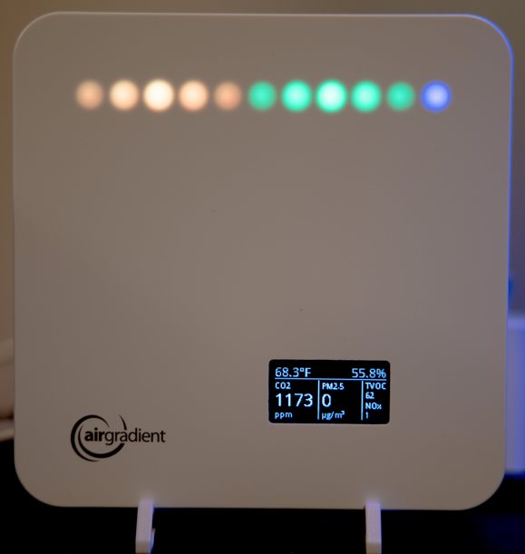

# Конфигурации AirGradient ESPHome

> **Примечание**: Это форк оригинального репозитория [MallocArray/airgradient_esphome](https://github.com/MallocArray/airgradient_esphome) с рядом улучшений:
> - Улучшена безопасность: добавлено шифрование API, защита паролем для OTA и резервной точки доступа
> - Добавлена нормализация показаний датчиков с использованием скользящего среднего (период 5 минут)
> - Для устройств на ESP32 рекомендуется использовать фильтр Калмана для более точной фильтрации показаний

Этот репозиторий содержит конфигурации ESPHome для устройств AirGradient. Поддерживаются следующие устройства:

- AirGradient ONE
- AirGradient PRO
- AirGradient BASIC
- AirGradient Open Air

## Установка

Смотрите [installation.md](installation.md) для подробных инструкций по установке.

## Конфигурация

Смотрите [configuration.md](configuration.md) для подробной информации о конфигурации.

## Критические изменения

### 2024-05-13

- Добавлена поддержка для устройств Open Air с несколькими датчиками PMS5003T
- Добавлена поддержка для следующих комбинаций датчиков:
  - PMS5003
  - PMS5003 + SGP41
  - PMS5003 + SHT31
  - PMS5003 + BME680
  - PMS5003 + SGP41 + SHT31
  - PMS5003 + SGP41 + BME680
  - PMS5003 + SHT31 + BME680
  - PMS5003 + SGP41 + SHT31 + BME680

## Поддерживаемые датчики

### Температура и влажность
- SHT31
- SHT4X
- BME680

### Качество воздуха
- PMS5003
- PMS5003T
- SGP41

### CO2
- Senseair S8
- SCD30
- SCD4X

### Другие
- BME680 (давление)
- SGP41 (NOx)

## Лицензия

Этот проект распространяется под лицензией MIT. Смотрите файл [LICENSE](LICENSE.txt) для подробностей.

## Поддержите создателей проекта

## Планы на будущее

В репозиторий планируется добавить больше функций:

- [ ] Алгоритмы коррекции для конкретных моделей PMS5003
