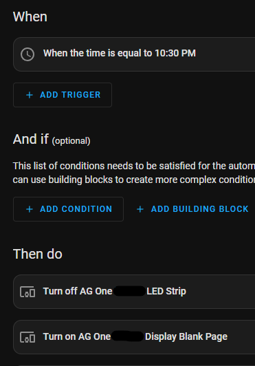

# Конфигурация

## Общие настройки

### Wi-Fi

```yaml
wifi:
  ssid: !secret wifi_ssid
  password: !secret wifi_password
  fast_connect: true
  power_save_mode: none
```

### API

```yaml
api:
  encryption:
    key: !secret api_encryption_key
```

### OTA

```yaml
ota:
  password: !secret ota_password
```

### Логирование

```yaml
logger:
  level: DEBUG
  baud_rate: 0
```

## Настройки датчиков

### PMS5003

```yaml
sensor:
  - platform: pmsx003
    type: PMS5003
    pm_1_0:
      name: "PM1.0"
    pm_2_5:
      name: "PM2.5"
    pm_10_0:
      name: "PM10.0"
```

### SGP41

```yaml
sensor:
  - platform: sgp41
    tvoc:
      name: "TVOC"
    nox:
      name: "NOx"
```

### SHT30

```yaml
sensor:
  - platform: sht3xd
    temperature:
      name: "Temperature"
    humidity:
      name: "Humidity"
```

## Настройки дисплея

### OLED

```yaml
display:
  - platform: ssd1306_i2c
    model: "SSD1306 128x64"
    address: 0x3C
    lambda: |-
      it.print(0, 0, id(font), "AirGradient");
      it.printf(0, 16, id(font), "PM2.5: %.1f", id(pm25).state);
      it.printf(0, 32, id(font), "CO2: %.0f", id(co2).state);
      it.printf(0, 48, id(font), "Temp: %.1fC", id(temperature).state);
```

## Настройки светодиодов

### LED Bar

```yaml
light:
  - platform: neopixelbus
    type: GRB
    pin: GPIO2
    num_leds: 10
    name: "AirGradient LED Bar"
    effects:
      - pulse:
          name: "Pulse"
          transition_length: 1s
          update_interval: 1s
```

## Настройки кнопок

```yaml
binary_sensor:
  - platform: gpio
    pin:
      number: GPIO0
      mode: INPUT_PULLUP
    name: "Button"
    on_press:
      - light.toggle: led_bar
```

Если все оригинальные датчики (PMS5003, Senseair S8, SHT4x) подключены, файлы конфигурации готовы к использованию.

Если некоторые датчики не установлены, закомментируйте или удалите соответствующие разделы в секции `packages:`

Датчик PMS5003 по умолчанию собирает показания каждую секунду. Поскольку этот датчик имеет ограниченный срок службы, можно продлить его жизнь, собирая показания реже, хотя это может повлиять на точность показаний, так как не будет постоянного потока воздуха через устройство, когда вентилятор выключается. Чтобы собирать показания каждые 2 минуты, измените строку для датчика pms5003 на `sensor_pms5003_extended_life.yaml`

> Подробнее см. [PMSX003 Particulate Matter Sensor — ESPHome](https://esphome.io/components/sensor/pmsx003.html#sensor-longevity)

Чтобы добавить SSID и пароль WiFi, добавьте информацию о вашей сети в соответствии со спецификациями ESPHome:

```yaml
wifi:
  ssid: NachoWiFi
  password: 123456123456
```

# Модификация

### Использование локальных пакетов

По умолчанию пакеты ссылаются на этот репозиторий GitHub, что позволяет выполнить новую установку из панели управления ESPHome для получения последних изменений без загрузки других файлов, но требует подключения к Интернету. Если вы хотите иметь больше контроля над модификациями или ссылаться только на локальные файлы, скопируйте папку `packages` в вашу локальную папку ESPHome в подпапку `packages` и замените `github://MallocArray/airgradient_esphome/packages` на `!include packages`

```yaml
# Пример
board: github://MallocArray/airgradient_esphome/packages/sensor_s8.yaml
# становится
board: !include packages/sensor_s8.yaml
```

### Использование функции Extend

Вместо загрузки отдельного пакета и обновления ссылки на него, вы также можете использовать опцию [Extend](https://esphome.io/guides/configuration-types.html#extend) для внесения небольших изменений без редактирования файла пакета. Это работает только для элементов с определенным `id:`

> Пример: добавление этого в основной файл для вашего устройства изменит номер контакта в пакете config_button, сохраняя все остальные настройки, определенные в пакете

```
binary_sensor:
  - id: !extend config_button
    pin:
      number: D7
```

### Копирование и вставка

Также можно скопировать содержимое файла пакета и вставить его непосредственно в ваш YAML файл. Обратите внимание, что разделы не могут дублироваться, поэтому если несколько разделов, таких как `interval`, вставлены, они должны быть объединены в одну запись при использовании этого метода.

### Добавление других пакетов

В папке `packages` доступно несколько дополнительных пакетов, которые можно добавлять или удалять по мере необходимости. Подробнее о доступных опциях см. на [странице пакетов](/packages.md).

### Дополнительная информация

Поддержка MQTT упоминалась на форумах AirGradient несколько раз. ESPHome поддерживает это, добавив несколько строк в основной yaml файл. Добавьте соответствующую информацию для вашей конфигурации. Подробнее здесь:
[https://esphome.io/components/mqtt.html](https://esphome.io/components/mqtt.html)

# Автоматизация Home Assistant

Интеграция ESPHome с Home Assistant открывает множество возможностей для создания пользовательских действий по вашему вкусу

## Отключение дисплея и светодиодов по времени

1. В Home Assistant перейдите в Настройки>Автоматизация и сцены
2. Нажмите кнопку "Создать автоматизацию", затем "Создать новую автоматизацию"
   1. Когда
      1. Добавить Триггер>Время>Режим>Фиксированное время
      2. Установите желаемое время для выключения дисплея и/или светодиодов
   2. Затем
      1. Добавить Действие>Устройство>Выберите ваш AirGradient из интеграции ESPHome
      2. В поле Действие выберите "Включить `<Название вашего AirGradient> Пустая страница дисплея`"
         1. Для базовой конфигурации с только пакетом одностраничного дисплея это установит дисплей для показа пустой страницы
         2. Если используется пакет multi_page, может потребоваться добавить дополнительные действия для отключения других включенных страниц
      3. Повторите действие для "Выключить `<Название вашего AirGradient> Светодиодная лента`" (если применимо)
   3. Нажмите кнопку Сохранить и дайте ей имя, например "Ночной режим AirGradient"
3. Повторите с новой автоматизацией, с обратными действиями (Выключить Пустую страницу дисплея и включить Светодиодную ленту), в желаемое время с именем, например "Выключение ночного режима AirGradient"
   
